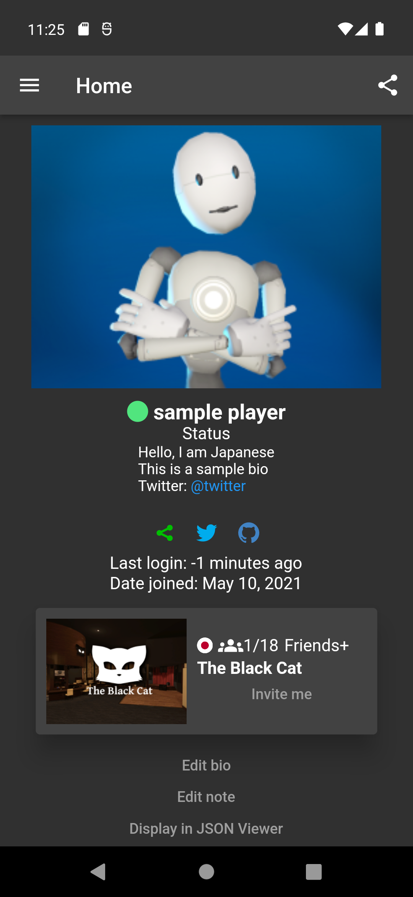

<h1 align="center">
  
</h1>

  

    <b>マルチプラットフォーム</b> Android, Windows(残念ながら Macbook を持っていません😫) 
    <b>多言語対応</b>  en, ja, es, pt, ru, th, zh 
    <b>複数のログイン方法に対応</b> 2fa, WebView, Token 
    <b>複数のアカウントに対応</b> Just H 用のアカウントをお持ちですか？ 
    <b>全て無料</b> もちろん広告もなし 
    <b>アプリリンクに対応</b> URL から直接アプリを開けます 
    <b>洗練された UI</b> モダンなデザイン 
    <b>ダークテーマに対応</b> 6種類のテーマと3種類の表示方法 
  

[English](README.md) / [Japanese](README-ja.md)

## インストール

### Android

- [**play.google.com**](https://play.google.com/store/apps/details?id=com.yuki0311.vrc_manager)
- [**appgallery.huawei.com**](https://appgallery.huawei.com/#/app/C106854219) **(非推奨)**
- [**Releases**](https://github.com/fa0311/vrc_manager/releases)の**app-release.apk**

### Windows

- [**Releases**](https://github.com/fa0311/vrc_manager/releases)の**VRCManager-Setup.exe**

## ドキュメント

開発・翻訳を手伝ってみませんか？ [**貢献**](docs/contribute/ja.md)

## 免責事項

VRChat API の使用に関する VRChat チーム(Tupper 氏)の公式な回答です。

> Use of the API using applications other than the approved methods (website, VRChat application) are not officially supported. You may use the API for your own application, but keep these guidelines in mind:
>
> - We do not provide documentation or support for the API.
> - Do not make queries to the API more than once per 60 seconds.
> - Abuse of the API may result in account termination.
> - Access to API endpoints may break at any given time, with no warning.
>
> [出典](https://vrchatapi.github.io/sdk/java/)
