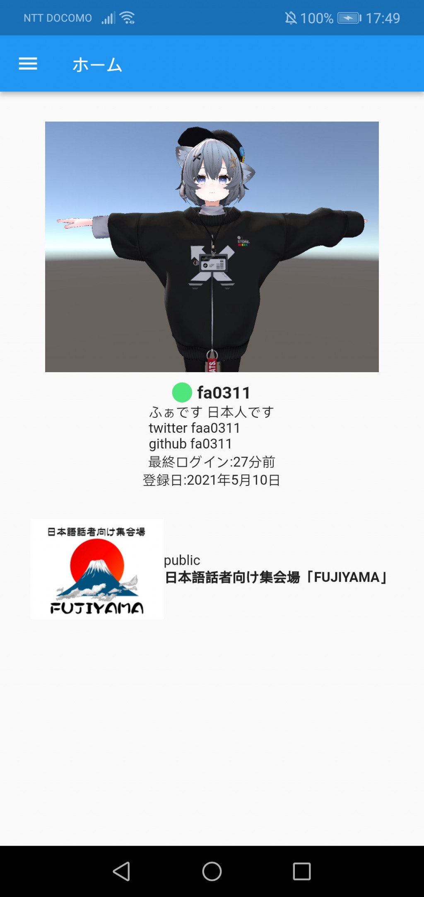
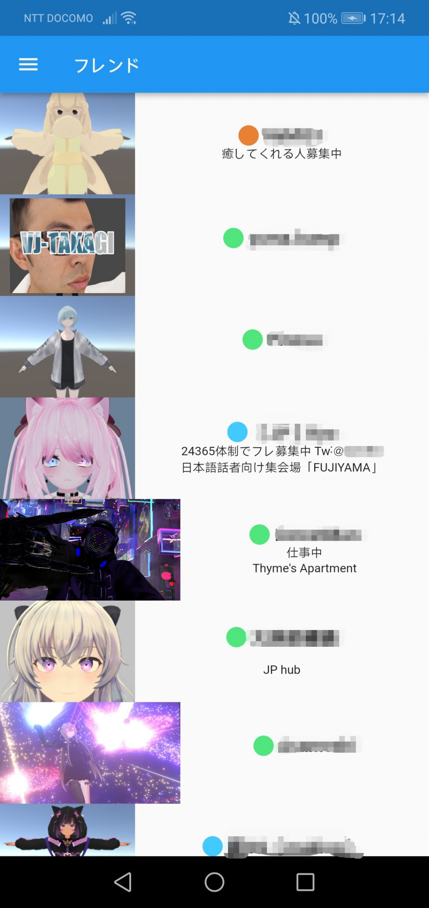
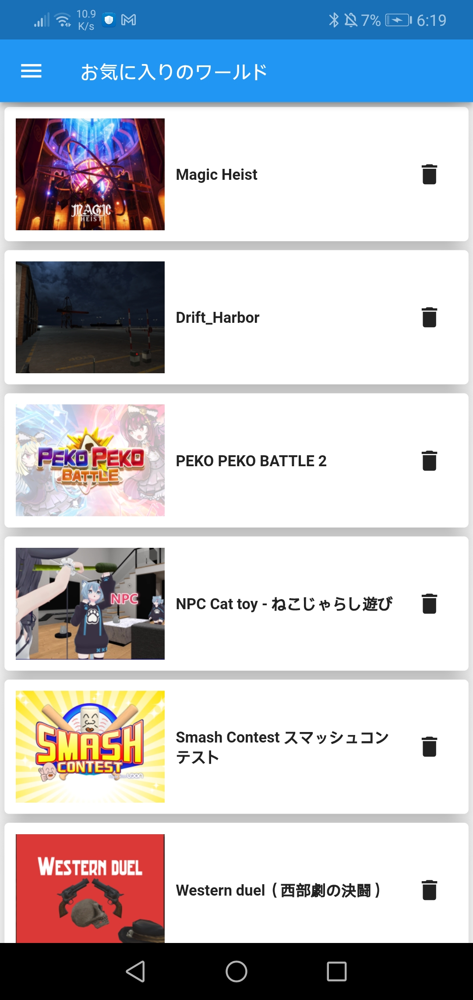
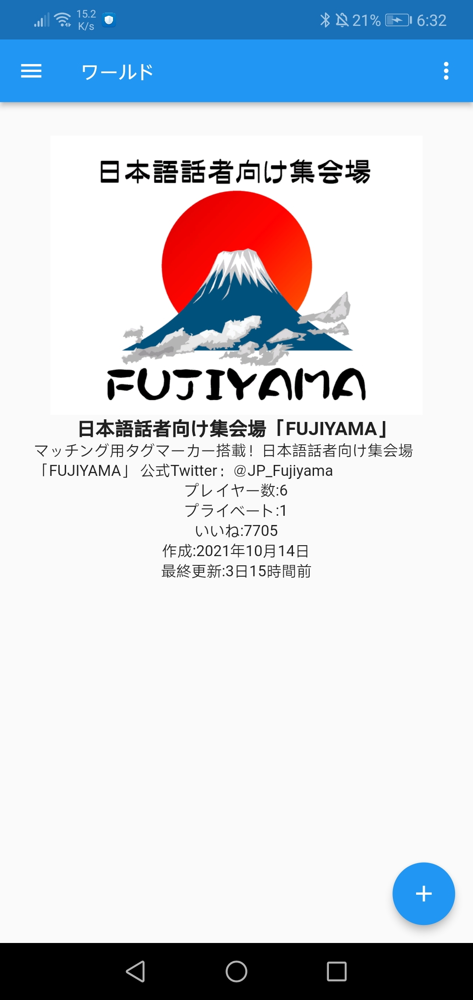
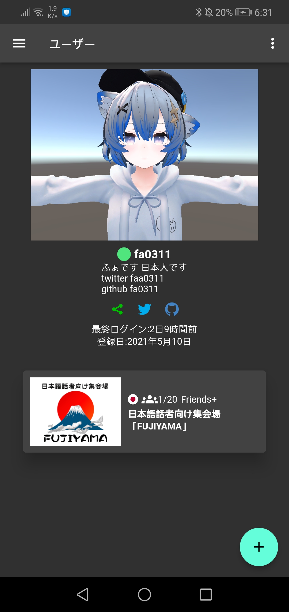

# VRChatMC

VRChat の非公式な API を利用した VRChat のモバイルクライアント<br>
Flutter で作成されたシンプルな UI が特徴的です<br>

## 特徴

- **マルチプラットフォーム** Android Windows(iOS 用の PullRequest Build は歓迎します)
- **多言語対応**
- **広告無し**
- **完全無料**
- **オープンソース**



## インストール

### Android

[**play.google.com**](https://play.google.com/store/apps/details?id=com.yuki0311.vrchat_mobile_client)からダウンロード<br>
もしくは
[**Releases**](https://github.com/fa0311/vrchat_mobile_client/releases)の**app-release.apk**をクリックしてダウンロード

### Windows

[**Releases**](https://github.com/fa0311/vrchat_mobile_client/releases)の**VRChatMC-Setup.exe**をクリックしてダウンロード

## 貢献

### ブランチについて

- **master** プロダクトリリース GooglePlay と同じ
- **pre** プレリリース 大きな機能追加もしくは GooglePlay の審査
- **develop** 開発バージョン PullRequest はここへ

### 翻訳

[lib/l10n](https://github.com/fa0311/vrchat_mobile_client/tree/develop/lib/l10n)

### セットアップ

```
flutter pub get
```

### ビルド

```
flutter run
```

## 免責事項

VRChat API の使用に関する VRChat チーム(Tupper 氏)の公式な回答です。

> Use of the API using applications other than the approved methods (website, VRChat application) are not officially supported. You may use the API for your own application, but keep these guidelines in mind:
>
> - We do not provide documentation or support for the API.
> - Do not make queries to the API more than once per 60 seconds.
> - Abuse of the API may result in account termination.
> - Access to API endpoints may break at any given time, with no warning.
