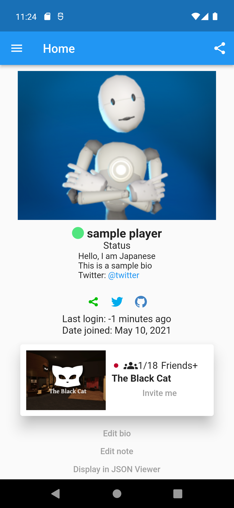
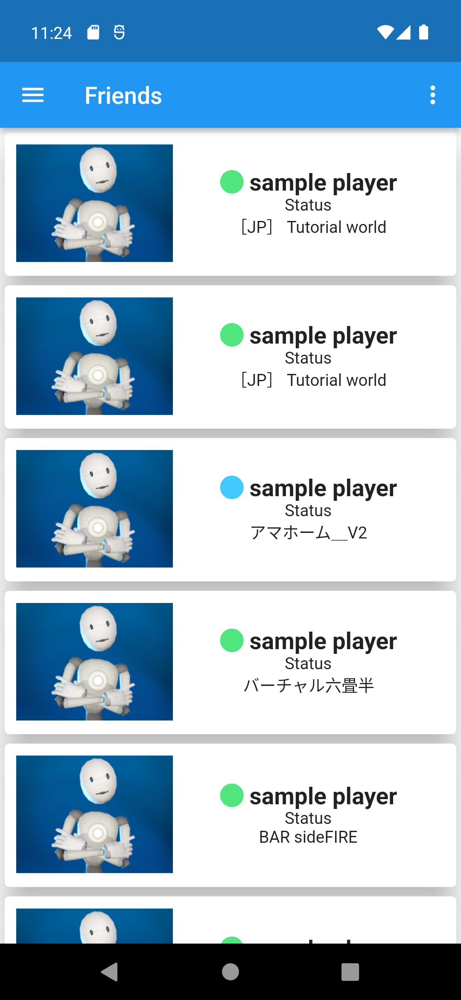
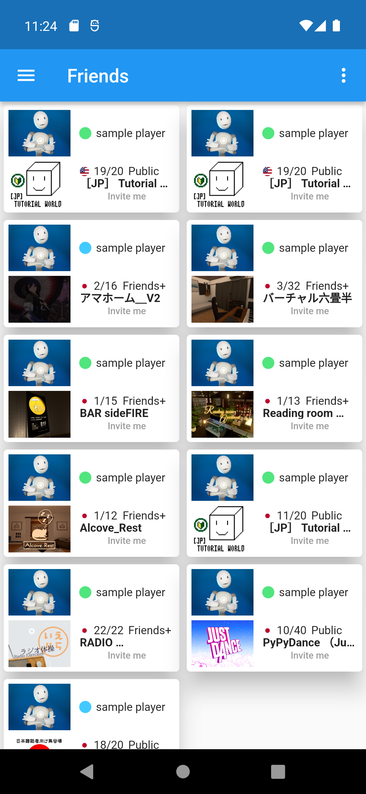
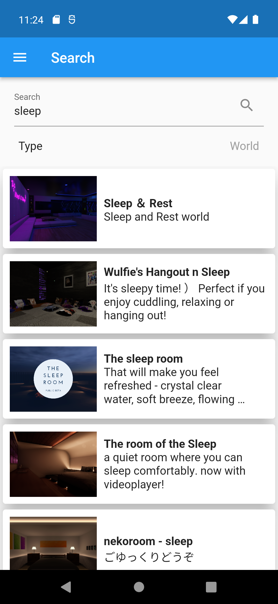
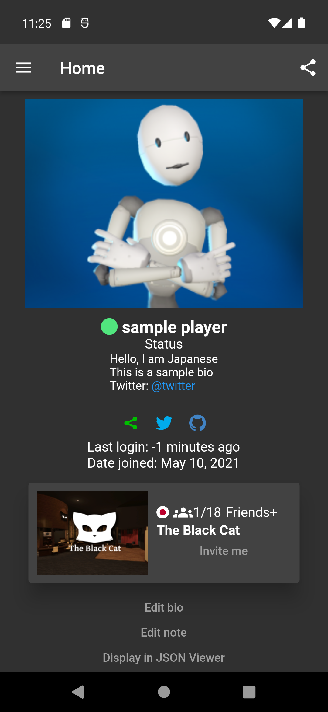

<h1 align="center">
  
</h1>

  

    <b>Multi platform</b> Android, Windows (unfortunately I don't have a Macbook😫) 
    <b>Multilingual support</b>  en, ja, es, pt, ru, th, zh 
    <b>Support for multiple login methods</b> 2fa, WebView, Token 
    <b>Multiple account support</b> Do you have a Just H account? 
    <b>Free for all</b> And of course, no ads. 
    <b>Supports application links</b> You can open the app directly from the URL 
    <b>Sophisticated UI</b> Modern design 
    <b>Supports dark themes</b> 6 different themes and 3 different display methods 
  

[English](README.md) / [Japanese](README-ja.md)

## Install

### Android

- [**play.google.com**](https://play.google.com/store/apps/details?id=com.yuki0311.vrc_manager)
- [**appgallery.huawei.com**](https://appgallery.huawei.com/#/app/C106854219) **(deprecated)**
- [**Releases**](https://github.com/fa0311/vrc_manager/releases) **app-release.apk**

### Windows

- [**Releases**](https://github.com/fa0311/vrc_manager/releases) **VRCManager-Setup.exe**

## Documents

Want to help with development and translation? [**contribute**](docs/contribute/en.md)

## Disclaimer

This is the official response of the VRChat Team (from Tupper more specifically) on the usage of the VRChat API.

> Use of the API using applications other than the approved methods (website, VRChat application) are not officially supported. You may use the API for your own application, but keep these guidelines in mind:
>
> - We do not provide documentation or support for the API.
> - Do not make queries to the API more than once per 60 seconds.
> - Abuse of the API may result in account termination.
> - Access to API endpoints may break at any given time, with no warning.
>
> [Reference](https://vrchatapi.github.io/sdk/java/)
